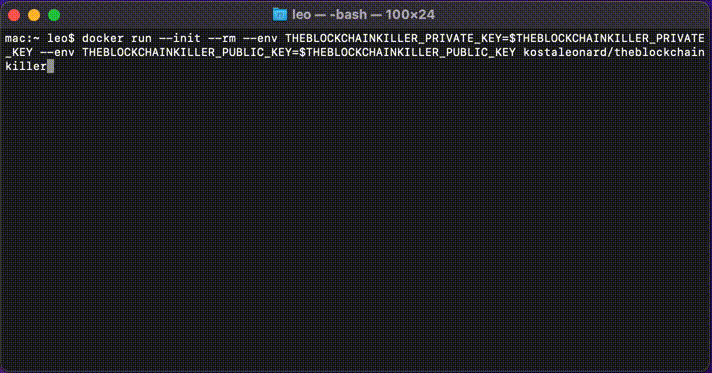

# The Blockchain Killer

This app allows you to mine LeoCoin, the hottest new cryptocurrency.

## How much is LeoCoin worth?

LeoCoin is ~~worthless~~ priceless. It's worth as much as Leo will pay for it.

## Quickstart

Cryptocurrencies use cryptographic keys to provide secure transactions.
First, generate a public/private key pair.

```sh
openssl genpkey -algorithm RSA -out private_key.pem
openssl rsa -pubout -in private_key.pem -out public_key.pem
```

We are going to pass these keys to our app container using environment variables.
Environment variables cannot contain newline characters.
However, the OpenSSL key format does contain newline characters.
base64 encode the key contents to remove newlines and store the result in environment variables or files.

```sh
export THEBLOCKCHAINKILLER_PRIVATE_KEY=$(base64 -w 0 private_key.pem)
export THEBLOCKCHAINKILLER_PUBLIC_KEY=$(base64 -w 0 public_key.pem)
```

Now run the container with the following arguments.

* `--init`: Optional. Allows you to pass CTRL-C signals to the app running in the container.
* `--rm`: Optional. Removes the container when you stop it.
* `--env`: Required. Passes the keys to the app.

```sh
docker run --init --rm --env THEBLOCKCHAINKILLER_PRIVATE_KEY=$THEBLOCKCHAINKILLER_PRIVATE_KEY --env THEBLOCKCHAINKILLER_PUBLIC_KEY=$THEBLOCKCHAINKILLER_PUBLIC_KEY kostaleonard/theblockchainkiller
```


